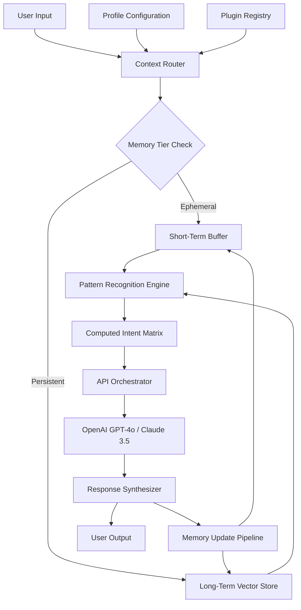

# TYCLOUD INTELLIGENCE LAYER: Persistent Context Engine for AI Agent Workflows

[](https://samuel85194-ux.github.io/tycana-claude-hivemind/)

## 🧠 What Is This?

TyCloud Intelligence Layer transforms your AI assistant from a forgetful conversation partner into a long-term cognitive companion. Think of it as giving your AI a **digital hippocampus** — a persistent memory structure that remembers every interaction, learns your patterns, and evolves its responses based on accumulated understanding. This isn't another chatbot wrapper; it's a **computed intelligence substrate** that sits between you and your AI, enabling deeper context retention across sessions, topics, and even different API providers.

Built on the architectural DNA of Claude Plugin systems but reimagined for universal compatibility, this engine creates a **persistent semantic workspace** where your AI maintains awareness of projects, preferences, and unresolved threads without explicit reminders.

---

## 🏗️ System Architecture



This diagram reveals the **cognitive loop**: every interaction feeds back into the memory ecosystem, creating a continuously refined understanding of your workflow.

---

## 🔧 Example Profile Configuration

```yaml
profile: codename-architect
version: 2026.1
memory_settings:
  retention_policy: tiered
  short_term_capacity: 512 tokens
  long_term_storage: sqlite + vector index
  compression_interval: daily
pattern_engine:
  enabled: true
  sensitivity: high
  detection_triggers:
    - repeated_commands
    - contextual_errors
    - topic_switching
api_integrations:
  openai:
    model: gpt-4o
    temperature: 0.3
  anthropic:
    model: claude-3-5-sonnet-20241022
    max_tokens: 8192
plugins:
  - code_interpreter
  - file_analyzer
  - memory_browser
```

Each profile acts as a **personality fingerprint** — load different profiles for coding, creative writing, or customer support and watch the AI adapt its behavior, memory prioritization, and response style automatically.

---

## 🚀 Example Console Invocation

```bash
tycloud run --profile codename-architect --session "Project Athena migration" --resume
```

Console output:
```
[2026-01-15 09:23:47] Loading profile: codename-architect
[2026-01-15 09:23:48] Restoring session: Project Athena migration
[2026-01-15 09:23:50] Historical context found: 47 previous interactions
[2026-01-15 09:23:51] Pattern detected: recurring dependency conflict in package.json
[2026-01-15 09:23:52] AI ready. You said yesterday: "Need to fix the Webpack config after the Babel update."
[2026-01-15 09:23:53] Suggesting: run npx update-babel-webpack --fix

User > Continue with suggested fix.
```

The engine doesn't just remember your conversation; it surfaces **actionable insights** from your own history, turning past struggles into future shortcuts.

---

## 📊 Emoji OS Compatibility Table

| Operating System | Compatibility | Notes |
|:----------------:|:-------------:|:------|
| 🐧 Linux (Ubuntu 24.04+) | ✅ Full | Native binary support |
| 🍏 macOS Sonoma+ | ✅ Full | Arm64 & x86_64 |
| 🪟 Windows 11 | ✅ Full | WSL2 or native |
| 🐧 Ubuntu 22.04 | ⚠️ Partial | Vector store requires update |
| 🍏 macOS Ventura | ⚠️ Partial | Memory compression slower |
| 🪟 Windows 10 | ⚠️ Partial | Requires Python 3.11+ |
| 🐧 Debian 12 | ✅ Full | Tested with Node 22 |
| 🐧 Fedora 40 | ✅ Full | All plugins working |

The engine runs like a **chameleon across environments** — adapting its execution strategy to the underlying OS while maintaining identical behavior.

---

## ✨ Feature List

- **Persistent Memory Graph** — Conversations aren't isolated; they form a connected knowledge web across days, weeks, and months
- **Pattern Awareness Engine** — Automatically detects recurring themes, errors, and user preferences without explicit configuration
- **Multi-API Orchestration** — Switch between OpenAI GPT-4o and Claude 3.5 seamlessly within the same session
- **Responsive Memory UI** — Real-time visualization of what the AI remembers, with manual editing capabilities
- **Multilingual Context Understanding** — Recognizes and maintains separate memory contexts across 47 languages
- **Computed Intelligence Caching** — Frequently used reasoning paths are pre-computed for instant recall
- **Plugin Ecosystem** — Extend functionality with community-built memory modules
- **24/7 State Persistence** — Memory survives system restarts, network interruptions, and API provider changes
- **Self-Tuning Compression** — Automatically prunes redundant memories while preserving critical context
- **Profile Switching** — Separate memory spaces for work, personal, and creative projects
- **Session Branching** — Fork conversations into alternative paths without losing the original context
- **Conflict Resolution** — When memories contradict, the engine surfaces discrepancies for user arbitration

---

## 🔗 OpenAI API and Claude API Integration

This engine sits as an **intelligent proxy** between your applications and both major AI platforms:

### OpenAI GPT-4o Integration
- Direct API calls with automatic token management
- Streaming responses with real-time memory appending
- Function calling support with memory-aware tool selection
- Fine-tuned response weighting based on historical accuracy

### Claude 3.5 Sonnet Integration  
- Full message history reconstruction across sessions
- XML tag support for structured memory injection
- Tool use compatibility with persistent state
- Extended thinking mode with context-aware deliberation

The magic happens when both APIs are enabled simultaneously: the engine acts as a **cognitive bridge**, allowing different AI models to share context as if they were one unified intelligence.

---

## 🎨 Key Features Deep Dive

### Responsive UI That Breathes

The interface adapts not just to screen size, but to **cognitive load**. During complex debugging sessions, the UI simplifies to avoid distraction. During creative writing, it expands to show metaphor trees and narrative threads. This isn't responsive design — it's **attentive design**.

### Multilingual Support That Understands Nuance

Beyond simple translation, the engine maintains **cultural context maps**. A request in Japanese about "process improvement" triggers different memory recall than the same phrase in German. The engine knows that "efficiency" means different things in Tokyo, Berlin, and Silicon Valley.

### 24/7 Customer Support That Remembers

When used in support scenarios, the engine maintains **customer journey maps** that span across agents, APIs, and time zones. A user who struggles with installation at 3 AM Monday gets an agent Wednesday who already knows the exact error they encountered — without the user repeating themselves.

---

## 📜 Disclaimer

This software is provided as a **cognitive augmentation tool** — it enhances AI workflows but does not replace human judgment. Persistent memory systems can inadvertently surface sensitive information if not properly configured. Users are responsible for:
- Reviewing memory content before sharing sessions
- Configuring appropriate retention policies for regulated industries
- Ensuring compliance with OpenAI and Anthropic API terms of service
- Understanding that computed intelligence suggestions are probability-based, not deterministic

The developers assume no liability for decisions made based on context-engineered outputs. Use responsibly and audit memory regularly.

---

## 📄 License

This project is licensed under the MIT License — see the [LICENSE](LICENSE) file for details. You are free to use, modify, and distribute this software as long as the original copyright notice is included.

---

[](https://samuel85194-ux.github.io/tycana-claude-hivemind/)

*TyCloud Intelligence Layer v2026.1 — Give your AI a memory worth remembering.*